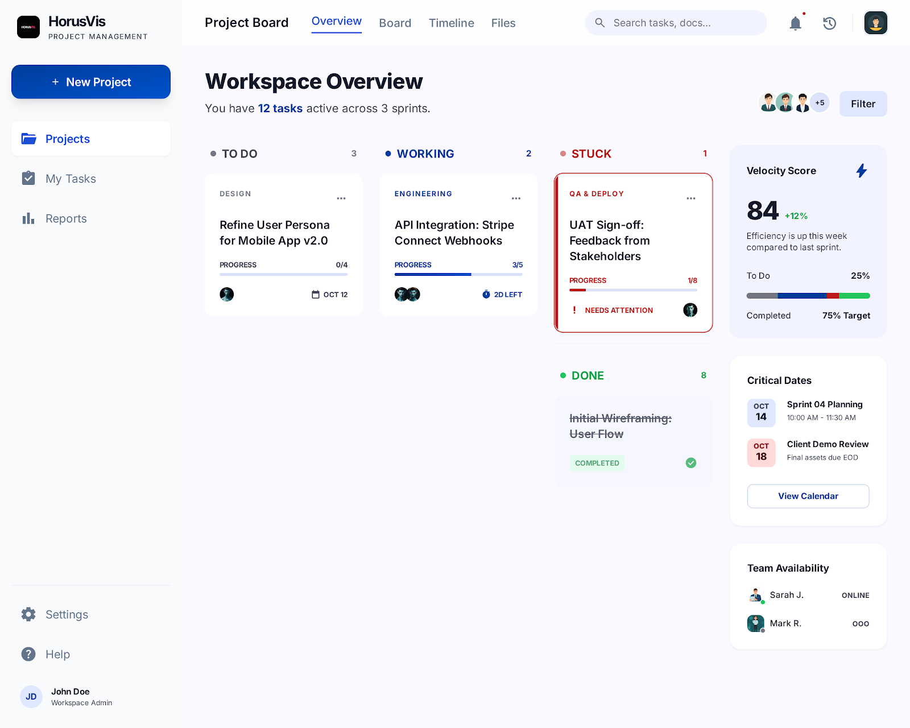
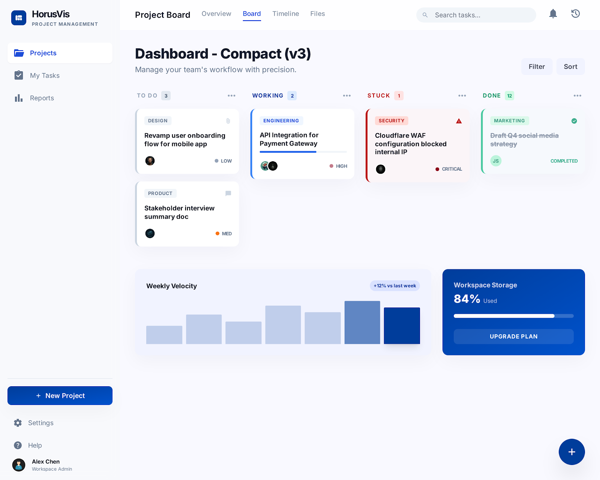

# 02. Projects

## Mục tiêu

Dựng page `Projects` làm entry point cho từng project, bao gồm overview, board, timeline, files, thành viên, module và các chỉ số vận hành ngắn hạn.

## FE checklist

- [ ] Dựng `ProjectsPage` với danh sách hoặc shell của project hiện tại.
- [ ] Tạo nút `New Project` và modal/form tạo project.
- [ ] Dựng header có tab `Overview`, `Board`, `Timeline`, `Files`.
- [ ] Xây dựng `Overview` hiển thị velocity score, critical dates, team availability.
- [ ] Xây dựng `Board` của project để nhìn tổng quan các task theo trạng thái.
- [ ] Thêm filter và search trong phạm vi project.
- [ ] Xây dựng giao diện quản lý thành viên: owner, members, team assignment.
- [ ] Xây dựng giao diện quản lý module/feature area cho project.
- [ ] Tạo trang hoặc panel chi tiết project.
- [ ] Hỗ trợ deep link từ project sang `My Tasks` và `Reports`.

## FE component cần làm

- `pages/ProjectsPage`
- `components/projects/ProjectHeader`
- `components/projects/ProjectTabs`
- `components/projects/NewProjectButton`
- `components/projects/NewProjectModal`
- `components/projects/ProjectOverviewCards`
- `components/projects/VelocityScoreCard`
- `components/projects/CriticalDatesCard`
- `components/projects/TeamAvailabilityCard`
- `components/projects/ProjectBoardPreview`
- `components/projects/ProjectMemberAvatarGroup`
- `components/projects/FeatureAreaList`
- `components/projects/ProjectFilterBar`

## BE checklist

- [ ] Tạo API lấy project list và project detail.
- [ ] Tạo API tạo mới, cập nhật, archive project.
- [ ] Tạo API quản lý thành viên dự án và team assignment.
- [ ] Tạo API quản lý `FeatureAreas` của project.
- [ ] Tạo query trả dữ liệu tổng hợp cho tab `Overview`.
- [ ] Tạo query trả preview board của project theo trạng thái task.
- [ ] Thêm phân quyền theo scope cho tạo/sửa/archive project.
- [ ] Tối ưu query cho project list có filter theo status, owner, date range.

## BE module cần làm

- `Controllers/ProjectsController`
- `Services/ProjectsService`
- `Services/ProjectMembersService`
- `Services/FeatureAreasService`
- `Queries/ProjectOverviewQuery`
- `Queries/ProjectBoardPreviewQuery`
- `Models/Projects/ProjectListResponse`
- `Models/Projects/ProjectDetailResponse`
- `Models/Projects/CreateProjectRequest`
- `Models/Projects/UpdateProjectRequest`

## API contract dùng chung

- `GET /api/projects`
- `POST /api/projects`
- `GET /api/projects/{projectId}`
- `PUT /api/projects/{projectId}`
- `GET /api/projects/{projectId}/members`
- `POST /api/projects/{projectId}/members`
- `GET /api/projects/{projectId}/feature-areas`
- `POST /api/projects/{projectId}/feature-areas`

## Ảnh tham chiếu

### Project overview

### Project board

