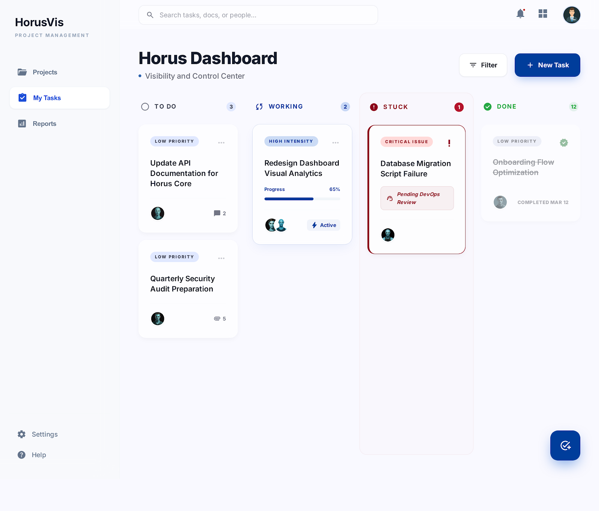
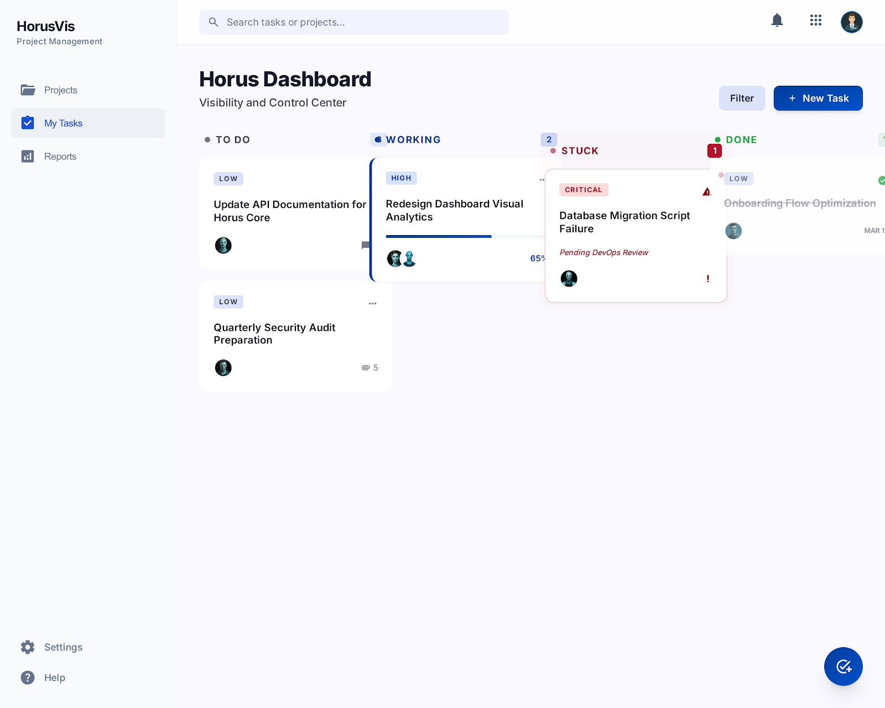
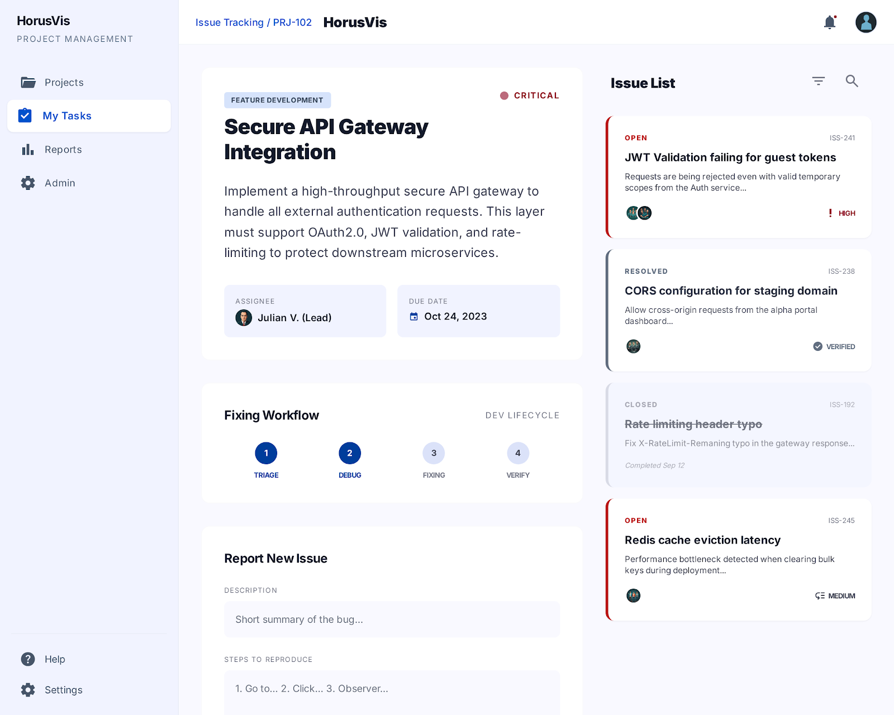

# 03. My Tasks

## Mục tiêu

Dựng page `My Tasks` là work area chính của người dùng, nơi quản lý `Task`, `Issue` và `Subtask`, đồng thời theo dõi progress của task từ effort thực tế của subtasks.

## FE checklist

- [ ] Dựng `MyTasksPage` với board Kanban gồm `To Do`, `Working`, `Stuck`, `Done`.
- [ ] Dựng `TaskCard` hiển thị priority, assignee, comment count, progress, active state.
- [ ] Tạo modal hoặc panel `New Task`.
- [ ] Tạo filter bar cho trạng thái, priority, project, owner.
- [ ] Tạo trang hoặc drawer `Task Detail`.
- [ ] Trong `Task Detail`, hiển thị danh sách `Issues` liên quan.
- [ ] Tạo màn hình `Issue Detail / Bug Tracking`.
- [ ] Dựng workflow `Triage -> Debug -> Fixing -> Verify`.
- [ ] Tạo form `Report New Issue`.
- [ ] Dựng `SubtaskTable` cho cả task và issue.
- [ ] Trong `SubtaskTable`, hỗ trợ các cột: `Rank`, `ID`, `Name`, `State`, `Owner`, `Project`, `To Do`, `Actuals`, `Estimate`.
- [ ] Dựng editor để cập nhật `EstimateHours`, `ToDoHours`, `ActualHours` của subtask.
- [ ] Kết nối API task/issue/subtask và refresh board sau khi cập nhật.

## FE component cần làm

- `pages/MyTasksPage`
- `components/tasks/KanbanBoard`
- `components/tasks/KanbanColumn`
- `components/tasks/TaskCard`
- `components/tasks/NewTaskModal`
- `components/tasks/TaskFilterBar`
- `components/tasks/TaskDetailDrawer`
- `components/issues/IssueListPanel`
- `components/issues/IssueCard`
- `components/issues/IssueDetailPage`
- `components/issues/FixingWorkflowStepper`
- `components/issues/ReportIssueForm`
- `components/subtasks/SubtaskTable`
- `components/subtasks/SubtaskRow`
- `components/subtasks/SubtaskStateBadge`
- `components/subtasks/SubtaskEffortEditor`
- `services/tasksApi`
- `services/issuesApi`
- `services/subtasksApi`
- `stores/myTasksStore`

## BE checklist

- [ ] Tạo API lấy `my-board` theo user hiện tại.
- [ ] Tạo CRUD cơ bản cho `Task`.
- [ ] Tạo CRUD cơ bản cho `Issue` gắn với `Task`.
- [ ] Tạo CRUD cơ bản cho `Subtask` gắn với `Task` hoặc `Issue`.
- [ ] Tính `Task.ProgressPercent` theo công thức `SUM(ActualHours) / SUM(EstimateHours)`.
- [ ] Chặn `Task` sang `Done` nếu còn issue mở hoặc còn subtask chưa hoàn tất.
- [ ] Chặn `Issue` sang `Closed` nếu còn subtask chưa hoàn tất.
- [ ] Tạo query task detail trả kèm issues và subtasks.
- [ ] Tạo query issue detail trả kèm subtasks, workflow và activity log.
- [ ] Tạo service cập nhật effort của subtask và tự recalculate task progress.
- [ ] Tạo service đồng bộ trạng thái `Stuck` nếu task bị block bởi issue critical/open.

## BE module cần làm

- `Controllers/TasksController`
- `Controllers/IssuesController`
- `Controllers/SubtasksController`
- `Services/TasksService`
- `Services/IssuesService`
- `Services/SubtasksService`
- `Services/TaskProgressCalculator`
- `Queries/MyBoardQuery`
- `Queries/TaskDetailQuery`
- `Queries/IssueDetailQuery`
- `Models/Tasks/*`
- `Models/Issues/*`
- `Models/Subtasks/*`

## API contract dùng chung

- `GET /api/tasks/my-board`
- `POST /api/tasks`
- `GET /api/tasks/{taskId}`
- `PUT /api/tasks/{taskId}`
- `GET /api/tasks/{taskId}/subtasks`
- `POST /api/tasks/{taskId}/subtasks`
- `GET /api/tasks/{taskId}/issues`
- `POST /api/tasks/{taskId}/issues`
- `GET /api/issues/{issueId}`
- `PUT /api/issues/{issueId}`
- `GET /api/issues/{issueId}/subtasks`
- `POST /api/issues/{issueId}/subtasks`
- `PUT /api/subtasks/{subtaskId}`

## Quy tắc nghiệp vụ cần triển khai

- `Task` và `Issue` là hai work item riêng.
- `Subtask` là đơn vị tracking effort dùng chung cho cả `Task` và `Issue`.
- `Task.ProgressPercent` không nhập tay; backend phải tự tính lại khi effort subtasks thay đổi.
- Nếu tổng `EstimateHours = 0` thì `ProgressPercent = 0`.
- Giá trị progress bị chặn tối đa ở `100%`.

## Ảnh tham chiếu

### Board chính của My Tasks

### Board layout phụ

### Issue detail / bug tracking

