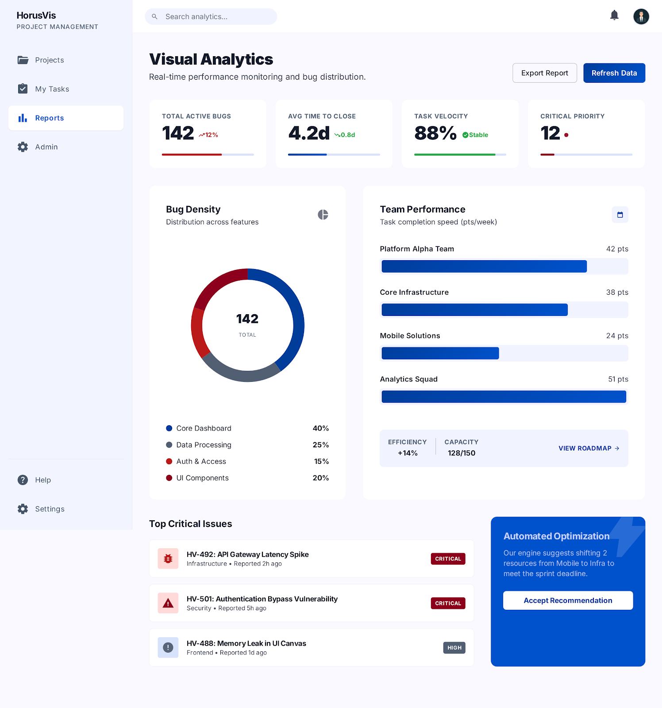

# 04. Reports

## Mục tiêu

Dựng page `Reports` phục vụ theo dõi KPI, bug density, performance của team, các critical issue và khuyến nghị tối ưu hóa.

## FE checklist

- [ ] Dựng `ReportsPage` với header, search, refresh và export.
- [ ] Tạo nhóm `KPI cards`: `Total Active Bugs`, `Avg Time To Close`, `Task Velocity`, `Critical Priority`.
- [ ] Dựng biểu đồ `Bug Density` theo `FeatureArea`.
- [ ] Dựng `Team Performance` chart.
- [ ] Tạo block `Capacity` và `Roadmap`.
- [ ] Dựng danh sách `Top Critical Issues`.
- [ ] Dựng panel `Automated Optimization`.
- [ ] Kết nối snapshot/report data từ backend.
- [ ] Hỗ trợ refresh dữ liệu thời gian thực.
- [ ] Hỗ trợ export báo cáo.

## FE component cần làm

- `pages/ReportsPage`
- `components/reports/ReportsHeader`
- `components/reports/KpiCardGrid`
- `components/reports/KpiCard`
- `components/reports/BugDensityChart`
- `components/reports/TeamPerformanceChart`
- `components/reports/CapacityRoadmapCard`
- `components/reports/CriticalIssuesList`
- `components/reports/RecommendationPanel`
- `components/reports/RefreshButton`
- `components/reports/ExportButton`
- `services/reportsApi`

## BE checklist

- [ ] Tạo API dashboard tổng hợp cho Reports.
- [ ] Tạo query lấy KPI cards từ `ReportSnapshots`.
- [ ] Tạo query `Bug Density` theo `FeatureArea`.
- [ ] Tạo query `Team Performance` theo team.
- [ ] Tạo query `Top Critical Issues`.
- [ ] Tạo service sinh `Recommendations`.
- [ ] Tạo export service cho report.
- [ ] Tối ưu performance cho các query analytics.

## BE module cần làm

- `Controllers/ReportsController`
- `Services/ReportsService`
- `Services/ReportExportService`
- `Services/RecommendationService`
- `Queries/ReportDashboardQuery`
- `Queries/BugDensityQuery`
- `Queries/TeamPerformanceQuery`
- `Queries/CriticalIssuesQuery`
- `Models/Reports/*`

## API contract dùng chung

- `GET /api/reports/dashboard`
- `POST /api/reports/export`
- `GET /api/reports/snapshots`
- `GET /api/reports/bug-density`
- `GET /api/reports/team-performance`
- `GET /api/reports/recommendations`

## Ảnh tham chiếu

