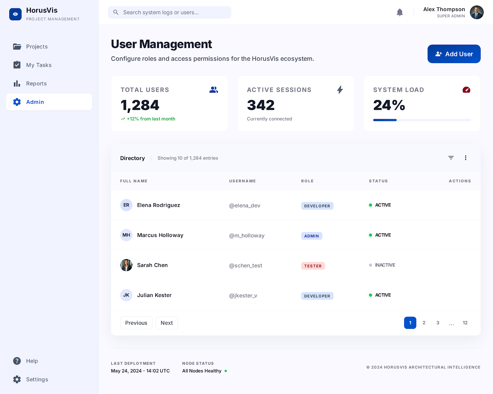

# 05. Admin

## Mục tiêu

Dựng page `Admin` để quản trị người dùng, role/scope, session, system load và deployment health.

## FE checklist

- [ ] Dựng `AdminPage` với search bar và action `Add User`.
- [ ] Tạo nhóm metrics gồm `Total Users`, `Active Sessions`, `System Load`.
- [ ] Dựng bảng `User Directory` với phân trang.
- [ ] Tạo modal hoặc drawer `Add User / Edit User`.
- [ ] Dựng quản lý role và permission theo scope.
- [ ] Dựng màn hình theo dõi `Active Sessions`.
- [ ] Hiển thị refresh token trạng thái `Active`, `Expired`, `Revoked`.
- [ ] Dựng widget `System Load` và `Node Status`.
- [ ] Dựng lịch sử `Deployment` gần nhất.
- [ ] Kết nối API admin cho user, role, session, system health.

## FE component cần làm

- `pages/AdminPage`
- `components/admin/AdminMetricsBar`
- `components/admin/UserDirectoryTable`
- `components/admin/UserDirectoryRow`
- `components/admin/AddUserModal`
- `components/admin/EditUserDrawer`
- `components/admin/RolePermissionMatrix`
- `components/admin/SessionMonitoringCard`
- `components/admin/SystemLoadCard`
- `components/admin/NodeHealthPanel`
- `components/admin/DeploymentStatusPanel`
- `components/admin/AdminSearchBar`
- `components/common/Pagination`
- `services/adminApi`

## BE checklist

- [ ] Tạo API quản lý user: list, create, update status/profile.
- [ ] Tạo API quản lý role và permission theo scope.
- [ ] Tạo API trả số liệu `Total Users`, `Active Sessions`, `System Load`.
- [ ] Tạo API theo dõi session từ `UserSessions`.
- [ ] Tạo API system health và node status.
- [ ] Tạo API lấy lịch sử deployment gần nhất.
- [ ] Thêm phân quyền admin/super admin cho toàn bộ endpoint.

## BE module cần làm

- `Controllers/AdminUsersController`
- `Controllers/AdminRolesController`
- `Controllers/AdminSessionsController`
- `Controllers/SystemHealthController`
- `Controllers/DeploymentsController`
- `Services/AdminUsersService`
- `Services/AdminRolesService`
- `Services/AdminSessionsService`
- `Services/SystemHealthService`
- `Services/DeploymentsService`
- `Models/Admin/*`

## API contract dùng chung

- `GET /api/admin/users`
- `POST /api/admin/users`
- `PUT /api/admin/users/{userId}`
- `GET /api/admin/roles`
- `PUT /api/admin/roles`
- `GET /api/admin/sessions`
- `GET /api/admin/system-health`
- `GET /api/admin/deployments`

## Ảnh tham chiếu

